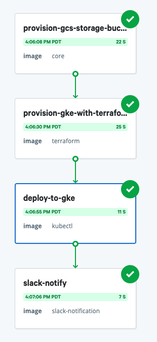

# Deploy a Gatsby site to Google Cloud Project with Terraform       

This sample workflow deploys a simple Gatsby site to Google Cloud Project (GCP).
The workflow provisions a Google Kubernetes Engine (GKE) cluster on
GCP using Terraform, and deploys the app to the cluster.

The workflow should appear on the **Workflows** page in your Nebula web interface. If you don't see
it there, add the workflow from our [examples repo](https://github.com/puppetlabs/nebula-workflow-examples/tree/master/example-workflows/gke-provision-and-deploy-workflow) on GitHub. 

## Prerequisites

Before you run the workflow, make sure you have access to the following:
- A Slack authentication token. For more information, see [Getting a Slack token](https://get.slack.help/hc/en-us/articles/215770388-Create-and-regenerate-API-tokens).
- An SSH key associated with your GitHub account. Encode the key using the base64
  encoding scheme.  
- A GCP project
- A GCP service account with the following permissions:
  - Cloud KMS Admin
  - Compute Admin
  - Kubernetes Engine Admin
  - Kubernetes Engine Cluster Admin
  - Editor
  - Role Administrator
  - Security Admin
  - Service Networking Admin
  - Source Repository Administrator
  - Storage Admin
  - Storage Object Admin
  > For more information on creating a service account, see [Creating and
  > managing service
  > accounts](https://cloud.google.com/iam/docs/creating-managing-service-accounts).
- Your GCP service account key. Encode the key using the base64
  encoding scheme. For more information on creating a service account key, see [Creating and managing service account
  keys](https://cloud.google.com/iam/docs/creating-managing-service-account-keys#iam-service-account-keys-create-gcloud).
- Make sure you've enabled Google Cloud's [Identity and Access Management (IAM) API](https://cloud.google.com/iam/reference/rest/)
- Make sure you've enabled Google Cloud's [Kubernetes Engine API](https://cloud.google.com/kubernetes-engine/docs/reference/rest/)

## Run the workflow

Follow these steps to run the workflow:
1. Add your Slack authentication token to the workflow as a secret.
   1. Click **Edit** > **Secrets**.
   2. Click **Define new secret** and use the following values:
      - **KEY**: `slacktoken`
      - **VALUE**: Enter your Slack authentication token
2. Add your GCP service account key as a secret.
   1. Click **Edit** > **Secrets**.
   2. Click **Define new secret** and use the following values:
      - **KEY**: `credentials`
      - **VALUE**: Enter your base64 encoded GCP service account key
3. Add your GitHub SSH key as a secret.
   1. Click **Edit** > **Secrets**.
   2. Click **Define new secret** and use the following values:
      - **KEY**: `gitkey`
      - **VALUE**: Enter your base64 encoded GitHub SSH key
4. Configure your workflow parameters.
   1. Click **Run** and enter the follwing parameters:
      - **kubectl_file_path**:
        `nebula-workflow-examples/example-workflows/gke-provision-and-deploy-workflow/deploy/deploy.yaml`.
        This is the location of the `kubectl` configuration file in the git repo.
      - **project**: Enter the name of your GCP project
      - **slack_channel**: Enter the name of the Slack channel you'd like to
        notify when the workflow completes. For example, `#nebula-workflows`.
      - **slack_message**: Enter a message for the Slack notification. For
        example, `K8s cluster successfully provisioned with Nebula!`
      - **terraform_state_bucket**: The name of the Google Storage bucket where
        Terraform stores its state. The name must be globally unique. 
5. Click **Run workflow** and wait for the workflow run page to appear. 

To find the URL for your Gatsby app:
1. From your GCP console, click **Kubernetes Engine** > **Services and Ingress**.
2. Copy the endpoint for **nebula-example** and paste the URL into a browser.

Congratulations! You've deployed an application to GCP using Terraform.

**Useful topics:**

- For more information on our curated step specifications, see [Step specifications](../step-specifications.md).
- If your team uses Microsoft teams, try the [Microsoft Teams notification](../step-specifications/msteams-notification.md) step.

